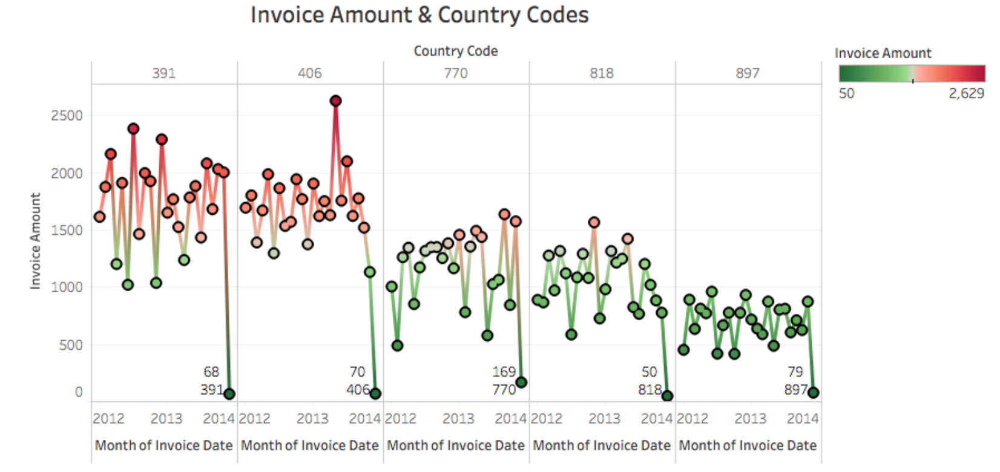
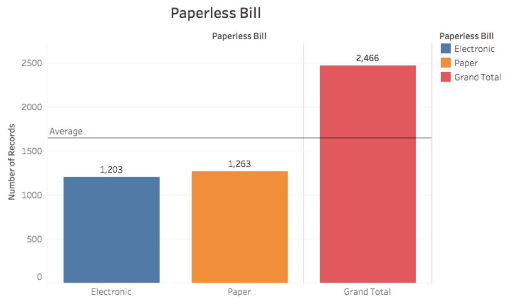
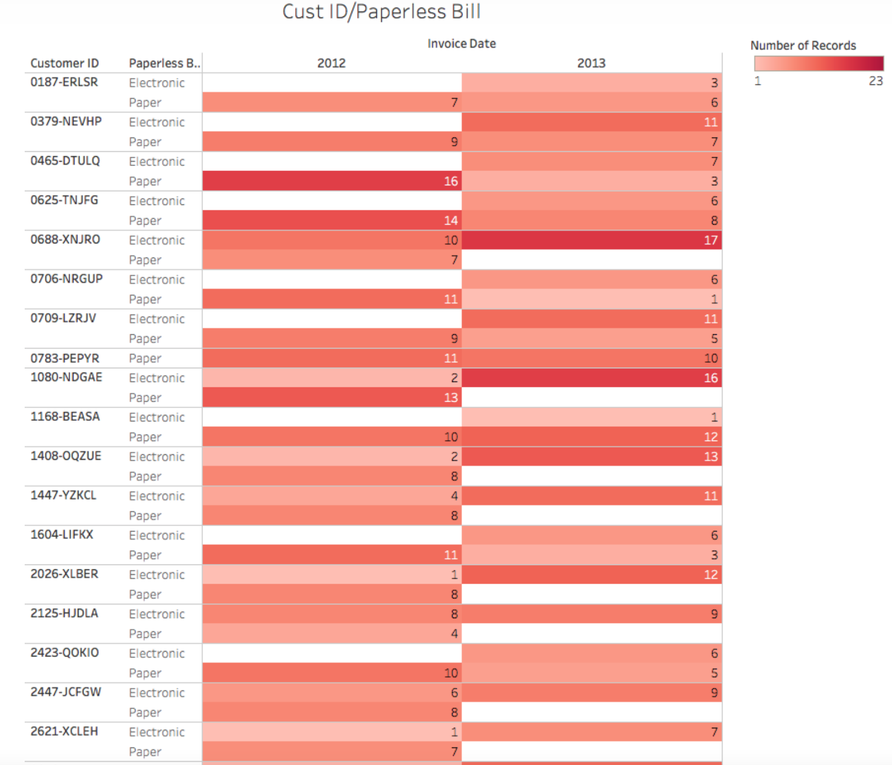
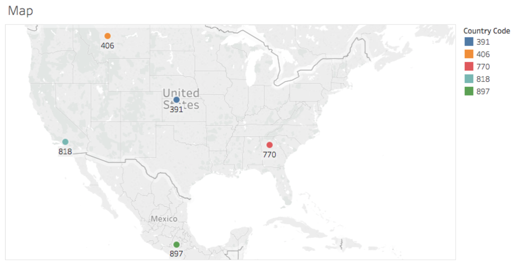
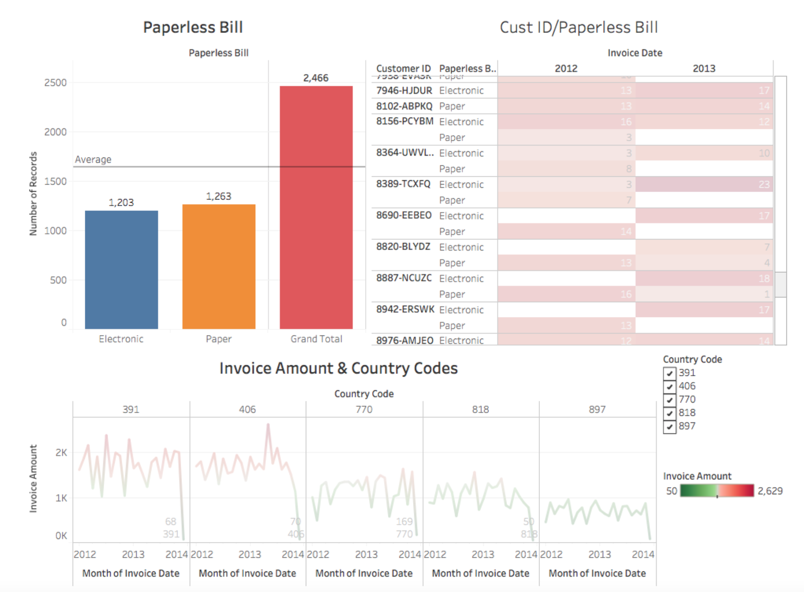
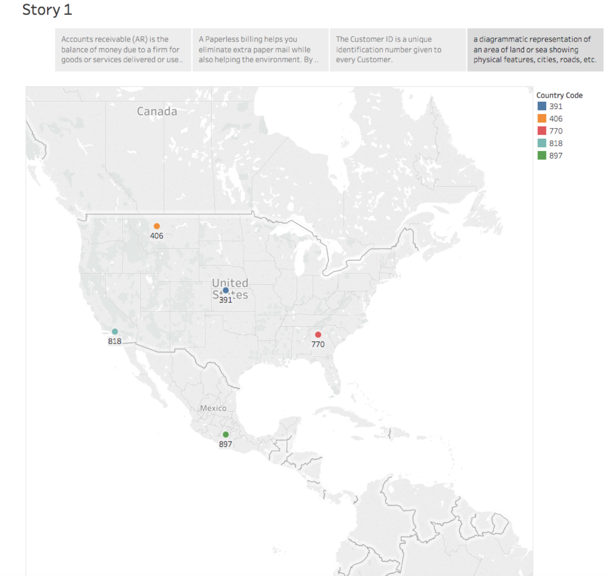

# Account Receivables Project on Tableau for IS344

The purpose of this project was to extract data from an Excel file to create visuals such as work sheets, dashboards, and a story sequence of customers invoices. 

## Images from Tableau   

In the stacked line graph above, the trend of sum of Invoice Amount for Invoice Data Month broken down to Country Code. The color represents the Invoice Amount in green and red. The marks indicate each data point from Invoice Amount and Month of Invoice Date.

In the bar graph above, we are comparing the sum of Number of Records of electronic billing and paper of 120 members including the sum for both. Each method is color coded and is filtered by Action(Month(Invoice Date), Country Code). 

In the diverging bar chart above, the Sum of Number of Records broken by Invoice Date Year vs. Customer ID and Paperless Bill. The color indicates the Sum of Number of Records. 

In the country code map above, is based on longitude (generated) and latitude (generated). The five Country Code colors are placed on point of interest (POI). 

Here is a collection of several views on this dashboard allowing us to compare a variety of data simultaneously. 

This is a story put together in a sequential order to tell a data narrative, provide context, and demonstrate how decisions relate to outcomes. 

### Learning Outcomes
